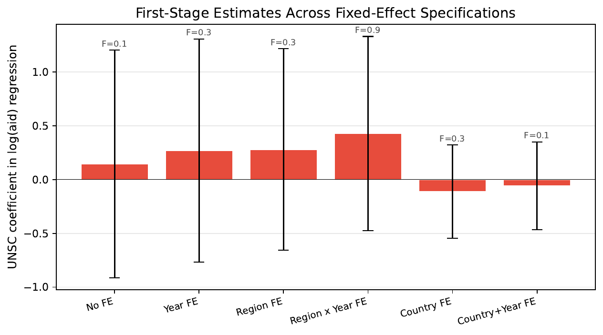
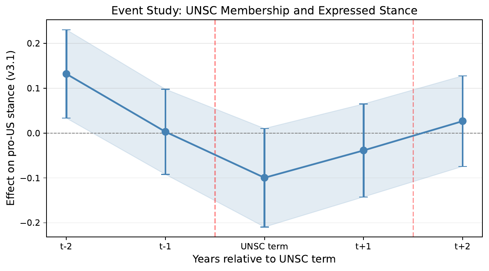
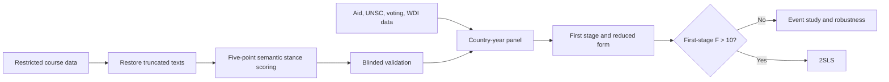

# What Can Money Buy?

## Material Power and the Limits of Allegiance

[Read the paper](paper/build/main.pdf) · [Aggregate results](tables/machine_readable/gate5_v3_1_all_results.csv) · [Stance rubric](research/stance_construct.md) · [Request data access](DATA_ACCESS.md)

Can foreign aid buy allegiance, or only cheap diplomatic gestures? This project tests whether temporary UN Security Council membership increases U.S. aid and, in turn, makes countries speak more warmly about the United States in their annual UN General Debate addresses.

This was a co-authored course project by **Peichen Wei and Junjie Chen** for *Intelligent Economics* (instructor: Tong Wang, University of Edinburgh), completed in July 2026.

### At a glance

- **Reconstructed the text corpus:** restored 3,764 truncated UN General Debate speeches and assembled a reproducible 1970–2020 panel of **7,866 speeches from 179 non-P5 countries**.
- **Built the research dataset:** linked the restored speeches to U.S. foreign aid, temporary UN Security Council membership, UN voting alignment, and World Bank macroeconomic controls.
- **Developed an auditable LLM measurement system:** designed and deployed a semantic scoring pipeline that classified every speech on a five-point U.S.-stance scale and returned verbatim target and evidence spans for each judgment.
- **Validated the LLM-generated outcome:** conducted a blinded, stratified 200-speech evaluation, achieving **quadratic-weighted κ = 0.646**, 74.0% raw agreement, and MAE = 0.285.
- **Connected LLM measurement to causal inference:** used the resulting stance measure in fixed-effect first-stage and reduced-form models, an event study, and robustness specifications with country-clustered standard errors.

### Main finding

The proposed instrument fails its first stage. In the preferred country-and-year fixed-effect specification, temporary UNSC membership does not predict U.S. aid (**F = 0.08**). The reduced-form estimate is negative but not conventionally significant (**β = −0.100, p = 0.075**). Following the pre-specified `F > 10` gate, the project does not report a causal 2SLS estimate.

The conclusion is deliberately modest: in these data, the UNSC–aid channel does not provide evidence that material transfers buy expressed pro-U.S. allegiance.





### Research pipeline



### Repository contents

| Path | Public contents |
|---|---|
| `paper/` | Compiled paper and LaTeX source |
| `code/restoration/` | Reusable speech-restoration logic |
| `code/measurement/` | Measurement prompts and scoring/validation code |
| `code/econometrics/` | Panel construction and econometric analysis code |
| `code/reporting/` | Figure and LaTeX-table generation |
| `tables/` and `figures/` | Aggregate, non-row-level results |
| `research/` | Identification and measurement documentation |
| `manifests/` | Release metadata without source records |

### Data access

The course-provided data, reconstructed speech corpus, row-level analysis panel, validation samples, evidence spans, and model batch outputs are **not included in this public repository**. They are available only upon request and subject to approval and the applicable course/source-data conditions. See [DATA_ACCESS.md](DATA_ACCESS.md).

Approved users can place the restricted files in the paths expected by the scripts and reproduce the analysis using:

```bash
python3 -m venv .venv
source .venv/bin/activate
pip install -r requirements.txt
python code/econometrics/03_rebuild_panel.py
python code/reporting/generate_figures_tables.py
```

The public integrity check verifies that restricted files have not accidentally entered the repository and that the released aggregate results retain their headline values:

```bash
python code/audit/validate_public_release.py
```

### Citation

Citation metadata are provided in [`CITATION.cff`](CITATION.cff). If you reuse the public code or results, please cite this repository and the original sources documented in the paper.
